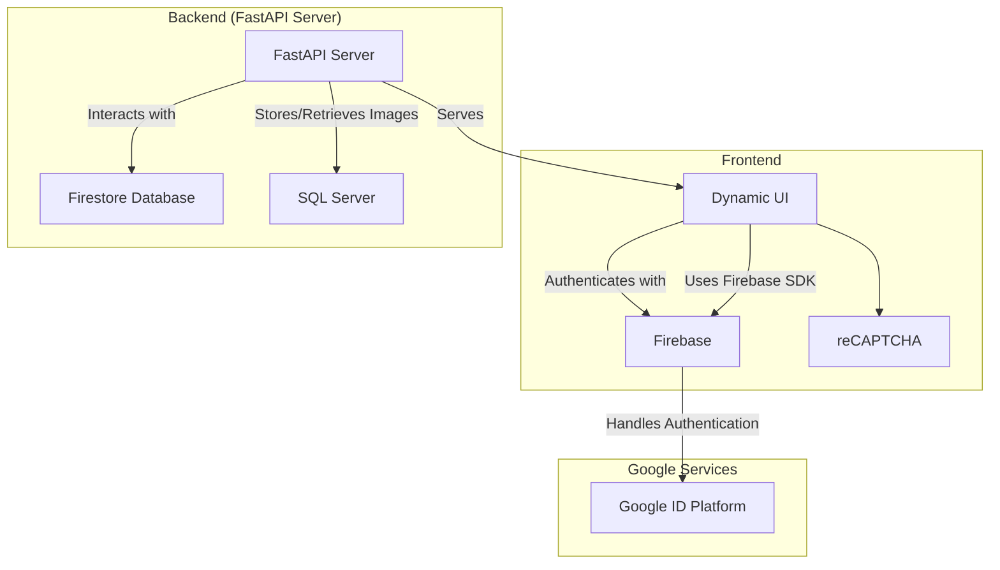

# QR Code Attendance (Strawhattendance)

## Architecture

```mermaid
graph TD;
    subgraph "Frontend"
        UI[Dynamic UI] -->|Authenticates with| Firebase
        UI --> Recaptcha["reCAPTCHA"]
    end

    subgraph "Backend (FastAPI Server)"
        FastAPI["FastAPI Server"] -->|Serves| UI
        FastAPI -->|Interacts with| Firestore
        FastAPI -->|Stores/Retrieves Images| SQLServer["SQL Server"]
    end

    subgraph "Google Services"
        Firebase -->|Handles Authentication| GoogleID["Google ID Platform"]
        Firestore["Firestore Database"]
    end

    UI -->|Uses Firebase SDK| Firebase
```
